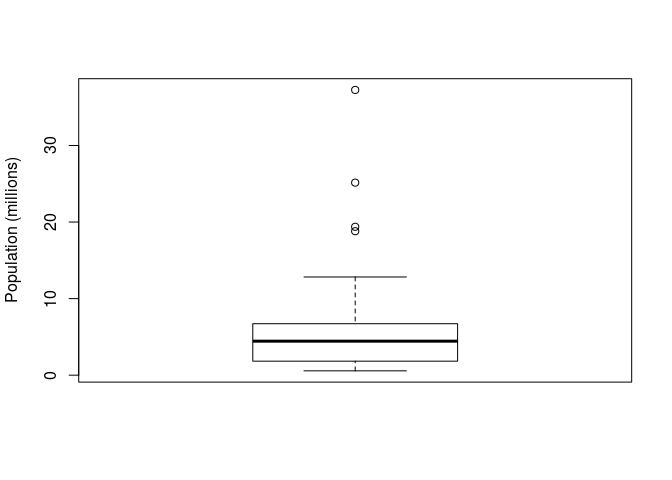
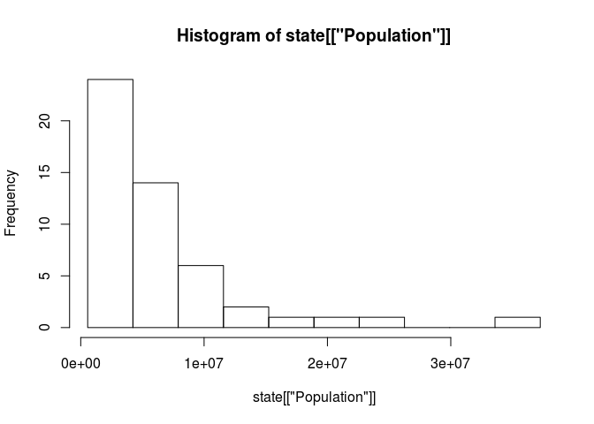

Exploratory Data Analysis
================

Location Estimates
==================

Load and inspect data
---------------------

``` r
path <- file.path('~', 'workspace', 'statistics_for_data_scientists', 'data')
fname <- 'state.csv'
state <- read.csv(file=file.path(path, fname))
head(state)
```

    ##        State Population Murder.Rate Abbreviation
    ## 1    Alabama    4779736         5.7           AL
    ## 2     Alaska     710231         5.6           AK
    ## 3    Arizona    6392017         4.7           AZ
    ## 4   Arkansas    2915918         5.6           AR
    ## 5 California   37253956         4.4           CA
    ## 6   Colorado    5029196         2.8           CO

Various loction estimates
-------------------------

### Population

``` r
# mean
mean(state[['Population']])
```

    ## [1] 6162876

``` r
# trimmed mean (exclude top and bottom 10%)
mean(state[['Population']], trim=0.1)
```

    ## [1] 4783697

``` r
# median
median(state[['Population']])
```

    ## [1] 4436370

### Murder rate

To compute the average murder rate aggregated across all states, we would need to use a weighted mean to account for the different populations in each state.

``` r
# weighted mean
weighted.mean(as.matrix(state[["Murder.Rate"]]), w=state[["Population"]])
```

    ## [1] 4.445834

``` r
# weighted median
library(matrixStats)
weightedMedian(as.matrix(state[['Murder.Rate']]), w=state[['Population']])
```

    ## [1] 4.4

Variability Estimates
=====================

``` r
# Standard deviation
sd(state[['Population']])
```

    ## [1] 6848235

``` r
# Interquartile range
IQR(state[['Population']])
```

    ## [1] 4847308

``` r
# Median absolute deviation from the median (MAD)
mad(state[['Population']])
```

    ## [1] 3849870

Exploring the Distribution
==========================

Boxplots
--------

``` r
boxplot(state[["Population"]]/1000000, ylab="Population (millions)")
```

 The top and bottom of the box are the 75th and 25th percentiles, respectively. The median is shown by the horizontal line in the box. The dashed lines, referred to as whiskers, extend from the top and bottom to indicate the range for the bulk of the data. There are many variations of a boxplot, but the R function extends the whiskers to the furthest point beyond the box, or 1.5 times the IQR (other software may use a different rule). Any data outside of the whiskers is plotted as single points, and may be flagged as outliers.

Frequency tables and histograms
-------------------------------

A frequency table of a variable divides up the variable range into equally spaced segments, and tells us how many values fall in each segment.

``` r
breaks <- seq(from=min(state[["Population"]]), to=max(state[["Population"]]), length=11)
pop_freq <- cut(state[["Population"]], breaks=breaks, right=TRUE, include.lowest = TRUE)
table(pop_freq)
```

    ## pop_freq
    ## [5.64e+05,4.23e+06]  (4.23e+06,7.9e+06]  (7.9e+06,1.16e+07] 
    ##                  24                  14                   6 
    ## (1.16e+07,1.52e+07] (1.52e+07,1.89e+07] (1.89e+07,2.26e+07] 
    ##                   2                   1                   1 
    ## (2.26e+07,2.62e+07] (2.62e+07,2.99e+07] (2.99e+07,3.36e+07] 
    ##                   1                   0                   0 
    ## (3.36e+07,3.73e+07] 
    ##                   1

Both frequency tables and percentiles summarize the data by creat ing bins. In general, quartiles and deciles will have the same count in each bin (equal-count bins), but the bin sizes will be different. The frequency table, by contrast, will have different counts in the bins (equal-size bins).

A histogram is a way to visualize a frequency table, with bins on the x-axis and data count on the y-axis.

``` r
hist(state[["Population"]], breaks=breaks)
```

 \#\# Density estimates

Add a new chunk by clicking the *Insert Chunk* button on the toolbar or by pressing *Ctrl+Alt+I*.

When you save the notebook, an HTML file containing the code and output will be saved alongside it (click the *Preview* button or press *Ctrl+Shift+K* to preview the HTML file).
