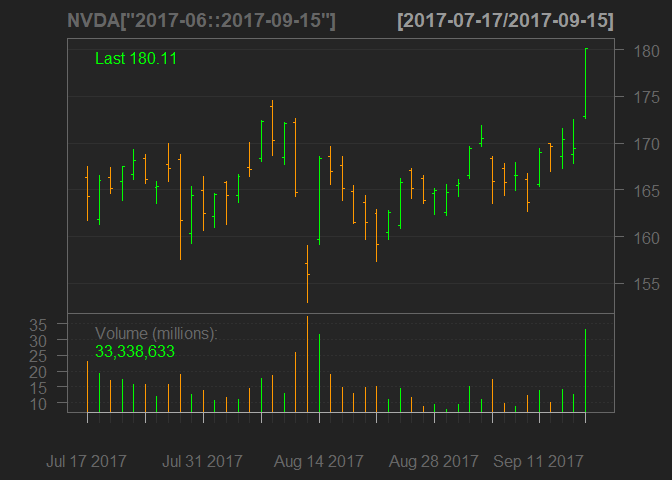
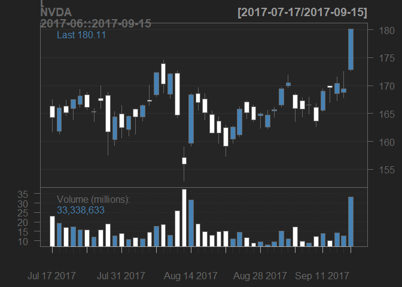
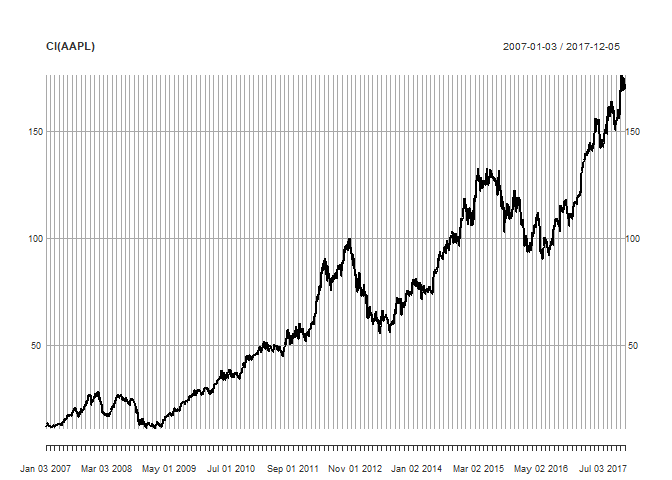
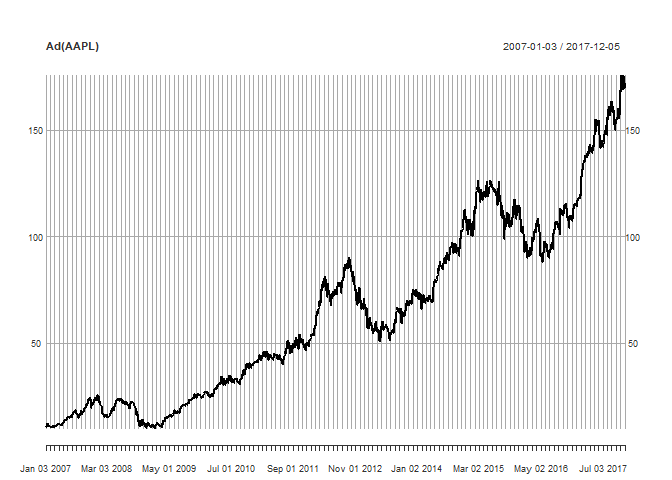
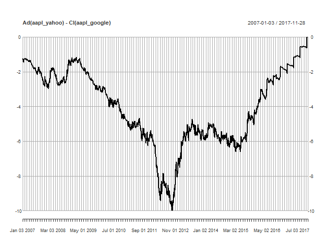
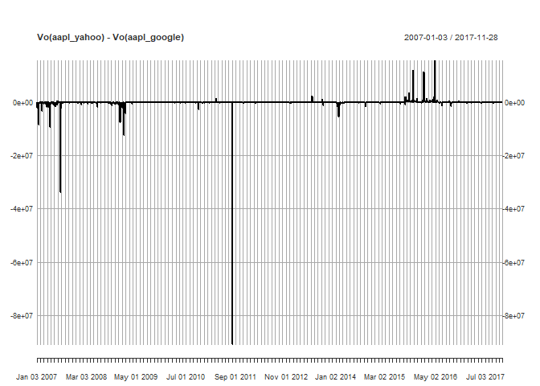

Getting and Managing Financial Data in R
================

This document describes how to get and manage financial data in R, from a variety of (free!) soruces.

Via `quantmod::getSymbols(Symbols = symbols, src = source, auto.assign = TRUE)` we have access to data from multiple sources via a convenient and extensible function. `symbols` is a single ticker/symbol/economic timeseries, or a character vector of the same.

`src` is the source of the data. `getSymbols()` can access data from:

-   Yahoo Finance
-   Google Finance
-   Alpha Vantage
-   Oanda (for foreign exchange data - last 180 days only)
-   Federal Reserve Economic Database (FRED - for economic timeseries)
-   CSV files
-   MySQL, SQLite
-   Rdata, rds

The default `src` is `"yahoo"`

By default, `getSymbols()` loads data diectly into the current seesion and assigns the data to an object with the same name as the symbol. To assign the data to an object of your choosing, set `auto.assign` to `FALSE`

By default, `getSymbols()` returns an `xts` (extensible time series) object.

Preliminaries: Getting, Insepcting, Plotting Data
=================================================

``` r
library(quantmod); library(Quandl)
```

Load some data from Yahoo
-------------------------

``` r
symbols <- c('IBM', 'MSFT')
getSymbols(symbols)
```

Display information about downloaded data
-----------------------------------------

``` r
str(IBM)
```

    ## An 'xts' object on 2007-01-03/2017-12-05 containing:
    ##   Data: num [1:2752, 1:6] 97.2 97.2 97.6 98.5 99.1 ...
    ##  - attr(*, "dimnames")=List of 2
    ##   ..$ : NULL
    ##   ..$ : chr [1:6] "IBM.Open" "IBM.High" "IBM.Low" "IBM.Close" ...
    ##   Indexed by objects of class: [Date] TZ: UTC
    ##   xts Attributes:  
    ## List of 2
    ##  $ src    : chr "yahoo"
    ##  $ updated: POSIXct[1:1], format: "2017-12-06 14:00:10"

``` r
head(MSFT)
```

    ##            MSFT.Open MSFT.High MSFT.Low MSFT.Close MSFT.Volume
    ## 2007-01-03     29.91     30.25    29.40      29.86    76935100
    ## 2007-01-04     29.70     29.97    29.44      29.81    45774500
    ## 2007-01-05     29.63     29.75    29.45      29.64    44607200
    ## 2007-01-08     29.65     30.10    29.53      29.93    50220200
    ## 2007-01-09     30.00     30.18    29.73      29.96    44636600
    ## 2007-01-10     29.80     29.89    29.43      29.66    55017400
    ##            MSFT.Adjusted
    ## 2007-01-03      22.96563
    ## 2007-01-04      22.92717
    ## 2007-01-05      22.79642
    ## 2007-01-08      23.01947
    ## 2007-01-09      23.04254
    ## 2007-01-10      22.81180

Import QQQ data from Google Finance
-----------------------------------

``` r
getSymbols(Symbols='QQQ', src='google')
```

``` r
str(QQQ)
```

    ## An 'xts' object on 2007-01-03/2017-12-05 containing:
    ##   Data: num [1:2751, 1:5] 43.5 43.3 43.9 43.9 44 ...
    ##  - attr(*, "dimnames")=List of 2
    ##   ..$ : NULL
    ##   ..$ : chr [1:5] "QQQ.Open" "QQQ.High" "QQQ.Low" "QQQ.Close" ...
    ##   Indexed by objects of class: [Date] TZ: UTC
    ##   xts Attributes:  
    ## List of 2
    ##  $ src    : chr "google"
    ##  $ updated: POSIXct[1:1], format: "2017-12-06 14:00:14"

Get some data from Alpha Vantage
--------------------------------

First, go get an API key. Then supply it as an argument to `getSymbols()`

``` r
getSymbols("NVDA", src = "av", api.key = "42MRB3A65R28LMCY")
```

Import GDP data from FRED
-------------------------

``` r
getSymbols(Symbols='GDP', src='FRED')
```

``` r
str(GDP)
```

    ## An 'xts' object on 1947-01-01/2017-07-01 containing:
    ##   Data: num [1:283, 1] 243 246 250 260 266 ...
    ##  - attr(*, "dimnames")=List of 2
    ##   ..$ : NULL
    ##   ..$ : chr "GDP"
    ##   Indexed by objects of class: [Date] TZ: UTC
    ##   xts Attributes:  
    ## List of 2
    ##  $ src    : chr "FRED"
    ##  $ updated: POSIXct[1:1], format: "2017-12-06 14:00:25"

Retrieve specific columns
-------------------------

``` r
close <- Cl(NVDA)
head(close)
```

    ##            NVDA.Close
    ## 2017-07-17     164.25
    ## 2017-07-18     165.96
    ## 2017-07-19     165.10
    ## 2017-07-20     167.50
    ## 2017-07-21     168.10
    ## 2017-07-24     166.15

Percent change, open to close
-----------------------------

``` r
pc_day_change <- OpCl(NVDA)
head(pc_day_change)
```

    ##               OpCl.NVDA
    ## 2017-07-17 -0.012505261
    ## 2017-07-18  0.025837557
    ## 2017-07-19 -0.007394938
    ## 2017-07-20  0.009461821
    ## 2017-07-21  0.008579828
    ## 2017-07-24 -0.013302453

Subsetting
----------

``` r
NVDA['2017'] # all data for 2017
NVDA['2017-01'] # all daya for January of 2017 
NVDA['2017-06::2017-09-15'] # June 2017 through September 15 2017
```

Simple bar chart
----------------

``` r
barChart(NVDA['2017-06::2017-09-15'])
```



Candle chart with technical indicator
-------------------------------------

``` r
chartSeries(NVDA['2017-06::2017-09-15'], up.col='steelblue', dn.col='white')
```



``` r
addBBands()
```


Retrieve data from quandl
-------------------------

<https://quandl.com/>. Some free datasets, others are paid. `Quandl::Quandl(code=src/symbol, type="xts")` always **returns **(not loads). Returns data frame by default

Sign up and get a free Quandl API key. Then do `Quandl.api_key('your_key')` to set you Quandl API key. Without a key, you are limited to 50 calls to the API per day.

### Download CME data for CL and BZ as an xts object

``` r
oil_data <- Quandl(code = c("CME/CLH2016", "CME/BZH2016"), type = "xts")
colnames(oil_data)
cl_open <- getPrice(oil_data, symbol = "CLH2016", prefer = "Open$") # The dollar sign is a regular expression to prevent you from also retrieving 'Open Interest'.
cl_open["2016-01"]
```

Advanced Tools and Techniques
=============================

How to get a single column from many instruments (USEFUL!!)
-----------------------------------------------------------

``` r
# Symbols
symbols <- c("AAPL", "MSFT", "IBM")

# Create new environment
data_env <- new.env()

# Load symbols into data_env
getSymbols(symbols, env=data_env)
```

    ## 'getSymbols' currently uses auto.assign=TRUE by default, but will
    ## use auto.assign=FALSE in 0.5-0. You will still be able to use
    ## 'loadSymbols' to automatically load data. getOption("getSymbols.env")
    ## and getOption("getSymbols.auto.assign") will still be checked for
    ## alternate defaults.
    ## 
    ## This message is shown once per session and may be disabled by setting 
    ## options("getSymbols.warning4.0"=FALSE). See ?getSymbols for details.

    ## 
    ## WARNING: There have been significant changes to Yahoo Finance data.
    ## Please see the Warning section of '?getSymbols.yahoo' for details.
    ## 
    ## This message is shown once per session and may be disabled by setting
    ## options("getSymbols.yahoo.warning"=FALSE).

    ## [1] "AAPL" "MSFT" "IBM"

``` r
# Extract the close column from each object and combine into one xts object
close_data <- do.call(merge, eapply(data_env, Cl))

# View the head of close_data
head(close_data)
```

    ##            AAPL.Close IBM.Close MSFT.Close
    ## 2007-01-03   11.97143     97.27      29.86
    ## 2007-01-04   12.23714     98.31      29.81
    ## 2007-01-05   12.15000     97.42      29.64
    ## 2007-01-08   12.21000     98.90      29.93
    ## 2007-01-09   13.22429    100.07      29.96
    ## 2007-01-10   13.85714     98.89      29.66

Manage clashing symbols and invalid R names
-------------------------------------------

Some symbols are not valid R names. Syntactically valid names contain letters, numbers, ".", and "\_", and must start with a letter or a "." followed by a non-number.

Berkshire Hathaway class A shares is one such example: "BRK-A" is not a syntactically valid name because it contains a "-" character. Similarly many Chinese stocks are problematic because they have symbols composed of numbers. The Yahoo Finance symbol for the SSE Composite Index is "000001.SS".

Use the `get()` function or backticks (\`) to access objects that do not have syntactically valid names.

``` r
# Load BRK-A data
getSymbols('BRK-A')
```

    ## [1] "BRK-A"

``` r
# Use backticks and head() to look at the loaded data
head(`BRK-A`)
```

    ##            BRK-A.Open BRK-A.High BRK-A.Low BRK-A.Close BRK-A.Volume
    ## 2007-01-03     110400     110600    109000      109000        67000
    ## 2007-01-04     109400     109400    108250      108850        46000
    ## 2007-01-05     108800     108800    107000      107200        42000
    ## 2007-01-08     107600     107800    107300      107500        34000
    ## 2007-01-09     107510     109600    107510      109350        40000
    ## 2007-01-10     109350     109550    108500      109490        37000
    ##            BRK-A.Adjusted
    ## 2007-01-03         109000
    ## 2007-01-04         108850
    ## 2007-01-05         107200
    ## 2007-01-08         107500
    ## 2007-01-09         109350
    ## 2007-01-10         109490

``` r
# Use get() to assign the BRK-A data to an object named BRK.A
BRK.A <- get("BRK-A")
```

When downloading data for a single symbol only, set `auto.assign = FALSE` in `getSymbols()`. That enables direct assignment of the output to a syntactically valid name.

You may also want to convert the column names to syntactically valid names, which is necessary in order to use the data in functions that expect column names to be syntactically valid.

``` r
# Create BRK.A object
BRK.A <- getSymbols('BRK-A', auto.assign = FALSE)

# Set BRK.A column names to syntactically valid names
col_names <- paste("BRK.A", 
                          c("Open", "High", "Low", "Close", "Volume", "Adjusted"),
                          sep=".")

colnames(BRK.A) <- col_names

# Another option: use make.names:
col_names <- colnames(BRK.A)
colnames(BRK.A) <- make.names(col_names)

# Shanghai composie
sse <- getSymbols("000001.SS", auto.assign = FALSE) #Shanghai index
```

    ## Warning: 000001.SS contains missing values. Some functions will not work if
    ## objects contain missing values in the middle of the series. Consider using
    ## na.omit(), na.approx(), na.fill(), etc to remove or replace them.

Creating valid names for multiple instruments
---------------------------------------------

If you want to download data for a lot symbols that are not syntactically valid names, or symbols that have names that conflict with other R variable names, use `setSymbolLookup()` to create a mapping between the instrument symbol and the name of the R object.

An example of a name that conflicts is the symbol for AT&T's stock, T, which is often used as a short form for the logical value TRUE.

To change the name of a given symbol, arguments must be passed to `setSymbolLookup()` as a list, like so: `setSymbolLookup(NEW_NAME = list(name = "OLD_NAME"))`.

``` r
# Set name for BRK-A to BRK.A
setSymbolLookup(BRK.A = list(name = "BRK-A"))

# Set name for T (AT&T) to ATT
setSymbolLookup(ATT = list(name = "T"))


# Load BRK.A and ATT data
getSymbols(c("BRK.A", "ATT"))
```

    ## 'getSymbols' currently uses auto.assign=TRUE by default, but will
    ## use auto.assign=FALSE in 0.5-0. You will still be able to use
    ## 'loadSymbols' to automatically load data. getOption("getSymbols.env")
    ## and getOption("getSymbols.auto.assign") will still be checked for
    ## alternate defaults.
    ## 
    ## This message is shown once per session and may be disabled by setting 
    ## options("getSymbols.warning4.0"=FALSE). See ?getSymbols for details.

    ## 
    ## WARNING: There have been significant changes to Yahoo Finance data.
    ## Please see the Warning section of '?getSymbols.yahoo' for details.
    ## 
    ## This message is shown once per session and may be disabled by setting
    ## options("getSymbols.yahoo.warning"=FALSE).

    ## [1] "BRK.A" "ATT"

Create a zero-width xts object with a regular index
---------------------------------------------------

In order to create regular data from an irregular data set, the first thing you need is a regular sequence of date-times that span the dates of your irregular data set. A "regular" sequence of date-times has equally-spaced time points.

Below, the irregular\_xts object is used to create a zero-width xts object that has a regular daily index. A zero-width xts object has an index of date-times, but no data columns.

``` r
# Extract the start date of the series
start_date <- start(irregular_xts)

# Extract the end date of the series
end_date <- end(irregular_xts)

# Create a regular date sequence
regular_index <- seq(start_date, end_date, by='day')

# Create a zero-width xts object
regular_xts <- xts(order.by = regular_index)
```

Merge irregular data with zero-width xts object with regular time index
-----------------------------------------------------------------------

When you create a regular series from an irregular series, the result usually has missing values (NA) because the irregular data does not have a value for all observations in the regular index. Here's how to handle them:

``` r
# Merge irregular_xts and regular_xts
merged_xts <- merge(irregular_xts, regular_xts)

# Look at the first few rows of merged_xts
head(merged_xts)

# Use the fill argument to fill NA with their previous value
merged_filled_xts <- merge(irregular_xts, regular_xts, fill = na.locf)

# Look at the first few rows of merged_filled_xts
head(merged_filled_xts)
```

Aggregate daily series to monthly, convert index to yearmon, merge with monthly series
--------------------------------------------------------------------------------------

Sometimes you may have two series with the same periodicity, but that use different conventions to represent a timestamp. For example, the monthly Fed Funds rate from FRED (FEDFUNDS) is the average of all the days in the month, but the first day of the month is used for the timestamp.

If you aggregate the daily Fed Funds rate from FRED (DFF), the timestamps of the aggregate object will likely be the last day of the month. If you then try to merge FEDFUNDS with the monthly aggregate of DFF, the result will have a lot of NA because the timestamps representing the month are the first and last days of the month, respectively.

The yearmon class from the zoo package can help solve this problem.

``` r
getSymbols(c("FEDFUNDS", "DFF"), src = "FRED")
```

    ## [1] "FEDFUNDS" "DFF"

``` r
# Aggregate DFF to monthly
monthly_fedfunds <- apply.monthly(DFF, mean, na.rm = TRUE)

# Convert index to yearmon
index(monthly_fedfunds) <- as.yearmon(index(monthly_fedfunds))


# Merge FEDFUNDS with the monthly aggregate
merged_fedfunds <- merge(FEDFUNDS, monthly_fedfunds)

# Look at the first few rows of the merged object
head(merged_fedfunds)
```

    ##            FEDFUNDS       DFF
    ## 1954-07-01     0.80 0.7993548
    ## 1954-08-01     1.22 1.2206452
    ## 1954-09-01     1.06 1.0666667
    ## 1954-10-01     0.85 0.8487097
    ## 1954-11-01     0.83 0.8336667
    ## 1954-12-01     1.28 1.2777419

Sometimes you may not be able to use convenience classes like `yearmon` to represent timestamps. In that case, you'll need to manually align merged data to the timestamp representation you prefer. The idea is to merge the lower-frequency data with the aggregate data, then use `na.locf()` to fill the missing values forward (or backward, using `fromLast = TRUE`). Then you can subset the result of the `na.locf()` call using the index of the object with the representation you prefer.

``` r
# Fill NA forward
merged_fedfunds_locf <- na.locf(merged_fedfunds)

# Extract index values containing last day of month
aligned_last_day <- merged_fedfunds_locf[index(monthly_fedfunds)]
head(aligned_last_day)
```

    ##            FEDFUNDS       DFF
    ## 1954-07-01     0.80 0.7993548
    ## 1954-08-01     1.22 1.2206452
    ## 1954-09-01     1.06 1.0666667
    ## 1954-10-01     0.85 0.8487097
    ## 1954-11-01     0.83 0.8336667
    ## 1954-12-01     1.28 1.2777419

``` r
# Fill NA backward
merged_fedfunds_locb <- na.locf(merged_fedfunds, fromLast = TRUE)

# Extract index values containing first day of month
aligned_first_day <- merged_fedfunds_locb[index(FEDFUNDS)]
head(aligned_first_day)
```

    ##            FEDFUNDS       DFF
    ## 1954-07-01     0.80 0.7993548
    ## 1954-08-01     1.22 1.2206452
    ## 1954-09-01     1.06 1.0666667
    ## 1954-10-01     0.85 0.8487097
    ## 1954-11-01     0.83 0.8336667
    ## 1954-12-01     1.28 1.2777419

### General aggregation

Sometimes you may need to aggregate in a more general way. Below, we aggregate daily data to weekly, but with weeks ending on Wednesdays. This is often done in stock market research papers to avoid some of the intra-week seasonality.

You can do many different types of aggregations by using `period.apply()` and supplying your own end points (versus using `endpoints()`). Recall that `endpoints()` returns the locations of the last observation in the period specified by its `on` argument, and the result always starts with a zero and ends with total number of observations. The end points you pass to `period.apply()` must follow this convention.

``` r
# Extract index weekdays
index_weekdays <- .indexwday(DFF)
head(index_weekdays)
```

    ## [1] 4 5 6 0 1 2

``` r
# Find locations of Wednesdays
wednesdays <- which(index_weekdays == 3)

# Create custom end points
end_points <- c(0, wednesdays, length(DFF))

# Calculate weekly mean using custom end points
weekly_mean <- period.apply(DFF, end_points, mean)
head(weekly_mean)
```

    ##                  DFF
    ## 1954-07-07 1.0014286
    ## 1954-07-14 1.2157143
    ## 1954-07-21 0.5714286
    ## 1954-07-28 0.6257143
    ## 1954-08-04 0.2700000
    ## 1954-08-11 1.3071429

### Combining data that have timezones

xts objects always store the index as seconds since the epoch (midnight, 1970-01-01) in the UTC timezone.

When you merge two (or more) xts objects, the merge will be performed using the underlying index (in UTC) and the resulting object will have the timezone of the first object passed to `merge()`. \`

``` r
# Create merged object with a Europe/London timezone
tz_london <- merge(london, chicago)

# Create merged object with a America/Chicago timezone
tz_chicago <- merge(chicago, london)
```

### Making irregular intraday-day data regular

We saw previously how to create a regular daily series from irregular daily data by merging a zero-width xts object with the irregular data. We can do the same thing with irregular intra-day data.

One difficulty with intra-day financial data is that it often does not span a full 24 hour period. Most markets are usually closed at least part of the day. This example will assume markets open at 9AM and close at 4PM Monday through Friday.

Also, your irregular data may not contain an observation exactly at the market open and/or close. In that case, you wouldn't be able to use `start()` and `end()` like you could for daily data. In order to create a regular date-time sequence, you will need to manually specify the start and end date-times when creating the regular date-time sequence.

The regular date-time sequence will include observations when the markets are closed, but you can use xts' time-of-day subsetting to keep only observations that occur when the market is open.

``` r
# Create a regular date-time sequence
regular_index <- seq(as.POSIXct("2010-01-04 09:00"), as.POSIXct("2010-01-08 16:00"), by = "30 min")

# Create a zero-width xts object
regular_xts <- xts(x = NULL, order.by = regular_index)

# Merge irregular_xts and regular_xts, filling NA with their previous value
merged_xts <- merge(irregular_xts, regular_xts, fill=na.locf)

# Subset to trading day (9AM - 4PM)
trade_day <- merged_xts['T09:00/T16:00']
```

### Fill missing values by trading day

The example above carried the last observation of the prior day forward into the first observation of the following day. Sometimes you may need to start each day without any value from the previous trading day.

This example shows how to fill missing values by trading day, without using the prior day's final value. We follow the split-lapply-rbind paradigm.

Recall that the `do.call(rbind, ...)` syntax allows you to pass a list of objects to `rbind()` instead of having to type all their names by hand.

`x_split <- split(x, f = "months")` `x_list <- lapply(x_split, cummax)` `x_list_rbind <- do.call(rbind, x_list)`

``` r
# Split trade_day into days
daily_list <- split(trade_day , f = "days")

# Use lapply to call na.locf for each day in daily_list
daily_filled <- lapply(daily_list, FUN = na.locf)

# Use do.call to rbind the results
filled_by_trade_day <- do.call(rbind, daily_filled)
```

### Aggregate irregular intraday-day data

Intraday data can often be massive. It's common to have hundreds of thousands of observations per day, millions per month, and hundreds of millions per year (per instrument!). These data sets often need to be aggregated before you can work with them.

We can use `endpoints()`, `period.apply()`, and `to.period()` to aggregate daily data. In this example, we use `to.period()` to aggregate intraday data to an OHLC series. You will often need to specify the period and k arguments to `to.period()` when using it with intraday data.

``` r
# Convert raw prices to 5-second prices
xts_5sec <- to.period(intraday_xts, period = "seconds", k = 5)

# Convert raw prices to 10-minute prices
xts_10min <- to.period(intraday_xts, period = "minutes", k = 10)

# Convert raw prices to 1-hour prices
xts_1hour <- to.period(intraday_xts, period = "hours", k = 1)
```

### Import well-formatted OHLC daily data from text file

Sometimes you need to import data from other software, and it is often easiest to write the data to CSV because almost all software can write data to a text file.

You can use `getSymbols()` to import the CSV if the data are well-formatted. In this case, *well-formatted* means the file contains data for a single instrument with date, open, high, low, close, volume, and adjusted close columns, in that order. This is the same format as `getSymbols()` returns when you download data from Yahoo Finance or Google Finance.

`getSymbols()` allows you to use a directory of CSV files as a source (like Yahoo Finance and FRED). Below we show how to load data from a local CSV file.

``` r
# Load AMZN.csv
getSymbols("AMZN", src = "csv")
```

### Import data from text file

When data aren't well-formatted, use the zoo package which provides several functions for importing text files (with just about any format) as zoo objects. The main function is `read.zoo()`, which is an interface to `read.table()`. Since the xts class extends zoo, you can easily convert the result of `read.zoo()` into an xts object by using `as.xts()`.

Here's how to use `read.zoo()` to import local CSV data.

``` r
# Import AMZN.csv using read.zoo
amzn_zoo <- read.zoo("AMZN.csv", sep = ",", header = TRUE)

# Convert to xts
amzn_xts <- as.xts(amzn_zoo)
```

### Handle date and time in separate columns

Sometimes you may have intraday data in a text file where the date and time values are in separate columns. It's simple to import data from this type of file using `read.zoo()`. Without `read.zoo()`, importing this type of file into an xts/zoo object would involve multiple steps.

`read.zoo()` has an index.column argument that allows you to specify the name or number of the column(s) that contain the index data. That's all you need to do if the date and time are specified in the standard format (`"%Y-%m-%d"` for date, and `"%H:%M:%S"` for time). Here's how to import this sort of data:

``` r
# Read data with read.csv
une_data <- read.csv("UNE.csv", nrows = 5)

# Look at the structure of une_data
str(une_data)

# Read data with read.zoo, specifying index columns
une_zoo <- read.zoo("UNE.csv", index.column = c("Date", "Time"), sep = ",", header =TRUE)

# Look at first few rows of data
head(une_zoo)
```

### Reading text file that contains multiple instruments

You can use `read.zoo()` to read data from text files with multiple instruments. This time we use its `split` argument, which allows you to specify the name or number of the columns(s) that contain the variables that identify unique observations.

``` r
# Read data with read.csv
two_symbols_data <- read.csv("two_symbols.csv", nrows = 5)

# Look at the structure of two_symbols_data
str(two_symbols_data)

# Read data with read.zoo, specifying index columns
two_symbols_zoo <- read.zoo("two_symbols.csv", split = c("Symbol", "Type"), sep = ",", header = TRUE)

# Look at first few rows of data
head(two_symbols_zoo)
```

### Missing Values and Corporate Actions

-   Adjusted prices account for splits and dividends.
-   Yahoo provides divident and split adjusted prices as well as raw.
-   Google provides split adjusted only, as well as raw.
-   Alpha Vantage provides split and dividend adjusted prices, as well as raw.

### Handle missing values

Previously we used `na.locf()` to fill missing values with the previous non-missing value. Sometimes simply carrying the previous value forward isn't appropriate. In those cases, you can interpolate a value instead. Here, we explore two interpolation methods: linear and spline.

Linear interpolation calculates values that lie on the line between two known data points. This is a good choice if your data are fairly linear (e.g. a series with a strong trend, like GDP).

If your data are not fairly linear, using linear interpolation can lead to large interpolation error. Spline interpolation is more appropriate in this case, because it provides a non-linear approximation using multiple data points.

Filling data via these methods is straightforward using `na.approx()` and `na.splie()`.

``` r
# fill NA using last observation carried forward
locf <- na.locf(DGS10)

# fill NA using linear interpolation
approx <- na.approx(DGS10)

# fill NA using spline interpolation
spline <- na.spline(DGS10)

# merge into one object
na_filled <- merge(locf, approx, spline)

# plot combined object
plot(na_filled, col = c("black", "red", "green"))
```

### Visualizing data

Plotting is one of the quickest and easiest ways to spot oddities in data. Whenever you import a new data set, one of the first things you should do is plot the variables to ensure they are reasonable.

Here, we use the `plot()` function to visualize some AAPL data from Yahoo Finance. A stock split in June 2014 caused a huge price change. A stock split is when a company simultaneously increases the number of shares outstanding and decreases the stock price, so that the value of the company remains unchanged. For example, a 2-for-1 stock split would give investors 2 shares for every 1 share they own, but reduce the stock price by 1/2 at the same time.

We also use the quantmod extractor functions, `Cl()` and `Ad()` to access the data in the close and adjusted close columns, respectively. Yahoo Finance provides the adjusted close column, which is a split- and dividend-adjusted version of the close prices. `Ad()` simply extracts the adjusted close column.

``` r
getSymbols('AAPL')
```

    ## [1] "AAPL"

``` r
# Look at the last few rows of AAPL data
tail(AAPL)
```

    ##            AAPL.Open AAPL.High AAPL.Low AAPL.Close AAPL.Volume
    ## 2017-11-28    174.30    174.87   171.86     173.07    26428800
    ## 2017-11-29    172.63    172.92   167.16     169.48    41666400
    ## 2017-11-30    170.43    172.14   168.44     171.85    41527200
    ## 2017-12-01    169.95    171.67   168.50     171.05    39759300
    ## 2017-12-04    172.48    172.62   169.63     169.80    32542400
    ## 2017-12-05    169.06    171.52   168.40     169.64    27285000
    ##            AAPL.Adjusted
    ## 2017-11-28        173.07
    ## 2017-11-29        169.48
    ## 2017-11-30        171.85
    ## 2017-12-01        171.05
    ## 2017-12-04        169.80
    ## 2017-12-05        169.64

``` r
# Plot close price
plot(Cl(AAPL))
```



``` r
# Plot adjusted close price
plot(Ad(AAPL))
```

 \#\#\# Cross-referencing sources to clean data

In this exercise, we cross-reference the Yahoo Finance AAPL data with AAPL data from Google Finance. Data from Google Finance is already adjusted for splits, but not dividends like the adjusted close from Yahoo Finance, so the close prices from Google won't align closely with the adjusted close prices from Yahoo Finance.

``` r
aapl_yahoo = getSymbols('AAPL', src='yahoo', auto.assign = FALSE)
aapl_google = getSymbols('AAPL', src='google', auto.assign = FALSE)
# Look at first few rows aapl_yahoo
head(aapl_yahoo)
```

    ##            AAPL.Open AAPL.High AAPL.Low AAPL.Close AAPL.Volume
    ## 2007-01-03  12.32714  12.36857 11.70000   11.97143   309579900
    ## 2007-01-04  12.00714  12.27857 11.97429   12.23714   211815100
    ## 2007-01-05  12.25286  12.31428 12.05714   12.15000   208685400
    ## 2007-01-08  12.28000  12.36143 12.18286   12.21000   199276700
    ## 2007-01-09  12.35000  13.28286 12.16429   13.22429   837324600
    ## 2007-01-10  13.53571  13.97143 13.35000   13.85714   738220000
    ##            AAPL.Adjusted
    ## 2007-01-03      10.73159
    ## 2007-01-04      10.96978
    ## 2007-01-05      10.89166
    ## 2007-01-08      10.94545
    ## 2007-01-09      11.85469
    ## 2007-01-10      12.42201

``` r
# Look at first few rows aapl_google
head(aapl_google)
```

    ##            AAPL.Open AAPL.High AAPL.Low AAPL.Close AAPL.Volume
    ## 2007-01-03     12.33     12.37    11.70      11.97   311433248
    ## 2007-01-04     12.01     12.28    11.97      12.24   214031636
    ## 2007-01-05     12.25     12.31    12.06      12.15   208817119
    ## 2007-01-08     12.28     12.36    12.18      12.21   199431337
    ## 2007-01-09     12.35     13.28    12.16      13.22   838036682
    ## 2007-01-10     13.54     13.97    13.35      13.86   739605951

``` r
# Plot difference between Yahoo adjusted close and Google close
plot(Ad(aapl_yahoo) - Cl(aapl_google))
```



``` r
# Plot difference between volume from Yahoo and Google
plot(Vo(aapl_yahoo) - Vo(aapl_google))
```

 \#\#\# Adjust for stock splits and dividends

Stock splits can create large price changes in historical data. Recall that splits do not change the value of the company. Therefore, in order to calculate historical returns correctly, you need to adjust all historical prices prior to the split.

For the same reason, you also need to adjust all historical prices prior to a dividend payment. Unlike splits, dividends do reduce the company's value, which should cause the price to fall by the amount of the dividend. But the investor's return isn't affected by this price change, because they received the offsetting dividend payment.

In this example, we use the `adjustOHLC()` function to adjust raw historical OHLC (Open, High, Low, Close) prices for splits and dividends, so historical returns can be calculated accurately.

Recall that Yahoo Finance provides the raw prices and an adjusted close column that has been adjusted for splits and dividends. In this exercise, you will use the adjustOHLC() function to adjust raw historical OHLC prices for splits and dividends, so they match the adjusted close column.

While not necessary to complete this exercise, Yahoo Finance provides an accessible example of the adjusted close calculation, if you're interested in learning more. [link](https://help.yahoo.com/kb/finance/SLN2311.html)

``` r
# Look at first few rows of AAPL
head(AAPL)
```

    ##            AAPL.Open AAPL.High AAPL.Low AAPL.Close AAPL.Volume
    ## 2007-01-03  12.32714  12.36857 11.70000   11.97143   309579900
    ## 2007-01-04  12.00714  12.27857 11.97429   12.23714   211815100
    ## 2007-01-05  12.25286  12.31428 12.05714   12.15000   208685400
    ## 2007-01-08  12.28000  12.36143 12.18286   12.21000   199276700
    ## 2007-01-09  12.35000  13.28286 12.16429   13.22429   837324600
    ## 2007-01-10  13.53571  13.97143 13.35000   13.85714   738220000
    ##            AAPL.Adjusted
    ## 2007-01-03      10.73159
    ## 2007-01-04      10.96978
    ## 2007-01-05      10.89166
    ## 2007-01-08      10.94545
    ## 2007-01-09      11.85469
    ## 2007-01-10      12.42201

``` r
# Adjust AAPL for splits and dividends
aapl_adjusted <- adjustOHLC(AAPL)

# Look at first few rows of aapl_adjusted
head(aapl_adjusted)
```

    ##            AAPL.Open AAPL.High AAPL.Low AAPL.Close AAPL.Volume
    ## 2007-01-03  1.196997  1.201020 1.136100   1.162457   309579900
    ## 2007-01-04  1.165925  1.192281 1.162734   1.188258   211815100
    ## 2007-01-05  1.189784  1.195749 1.170780   1.179796   208685400
    ## 2007-01-08  1.192420  1.200327 1.182987   1.185623   199276700
    ## 2007-01-09  1.199217  1.289800 1.181184   1.284112   837324600
    ## 2007-01-10  1.314353  1.356662 1.296319   1.345564   738220000
    ##            AAPL.Adjusted
    ## 2007-01-03      10.73159
    ## 2007-01-04      10.96978
    ## 2007-01-05      10.89166
    ## 2007-01-08      10.94545
    ## 2007-01-09      11.85469
    ## 2007-01-10      12.42201

### Download split and dividend data

`adjustOHLC()` only works for OHLC data. It will not work if you only have close prices. `adjustOHLC()` also does not return any of the split or dividend data it uses.

You will need the dates and values for each split and dividend if you want to adjust a non-OHLC price series, or if you simply want to analyze the raw split and dividend data.

You can download the split and dividend data from Yahoo Finance using the quantmod functions `getSplits()` and `getDividends()`, respectively. Note that the historical dividend data from Yahoo Finance is adjusted for splits. If you want to download unadjusted dividend data, you need to set `split.adjust = FALSE` in your call to `getDividends()`.

``` r
# Download AAPL split data
splits <- getSplits("AAPL")

# Print the splits object
splits
```

    ##             AAPL.spl
    ## 1987-06-16 0.5000000
    ## 2000-06-21 0.5000000
    ## 2005-02-28 0.5000000
    ## 2014-06-09 0.1428571

``` r
# Download AAPL dividend data
dividends <- getDividends("AAPL")

# Look at the first few rows of dividends
head(dividends)
```

    ##            AAPL.div
    ## 1987-05-11  0.00214
    ## 1987-08-10  0.00214
    ## 1987-11-17  0.00286
    ## 1988-02-12  0.00286
    ## 1988-05-16  0.00286
    ## 1988-08-15  0.00286

``` r
# Download unadjusted AAPL dividend data
raw_dividends <- getDividends("AAPL", split.adjust = FALSE)

# Look at the first few rows of raw_dividends
head(raw_dividends)
```

    ##            AAPL.div
    ## 1987-05-11  0.11984
    ## 1987-08-10  0.05992
    ## 1987-11-17  0.08008
    ## 1988-02-12  0.08008
    ## 1988-05-16  0.08008
    ## 1988-08-15  0.08008

### Adjust univariate data for splits and dividends

`adjustOHLC()` only works for OHLC data. If you only have close prices, you can use the `adjRatios()` function to calculate the split and dividend adjustment ratios. The `adjRatios()` function has three arguments: splits, dividends, and close. It returns an xts object with two columns, "Split" and "Div", that contain the split and dividend adjustment ratios, respectively.

`adjRatios()` needs split data in order to calculate the split adjustment ratio. You provide split data via the splits argument. To calculate the dividend adjustment ratio, you need to supply raw dividends and raw prices to `adjRatios()`, using the dividends and close arguments, respectively.

Once you have the split and dividend adjustment ratios, calculating the adjusted price is simple. You just have to multiply the unadjusted price by both the split and dividend adjustment ratios.

``` r
# Calculate split and dividend adjustment ratios
ratios <- adjRatios(splits = splits, dividends = raw_dividends, close = Cl(AAPL))

# Calculate adjusted close for AAPL
aapl_adjusted <- Cl(AAPL) * ratios[, "Split"] * ratios[, "Div"]

# Look at first few rows of Yahoo adjusted close
head(Ad(AAPL))
```

    ##            AAPL.Adjusted
    ## 2007-01-03      10.73159
    ## 2007-01-04      10.96978
    ## 2007-01-05      10.89166
    ## 2007-01-08      10.94545
    ## 2007-01-09      11.85469
    ## 2007-01-10      12.42201

``` r
# Look at first few rows of aapl_adjusted
head(aapl_adjusted)
```

    ##            AAPL.Close
    ## 2007-01-03   1.162457
    ## 2007-01-04   1.188258
    ## 2007-01-05   1.179796
    ## 2007-01-08   1.185623
    ## 2007-01-09   1.284112
    ## 2007-01-10   1.345564

**Remember that you need to back-adjust historical price data every time there is a split or dividend!**
